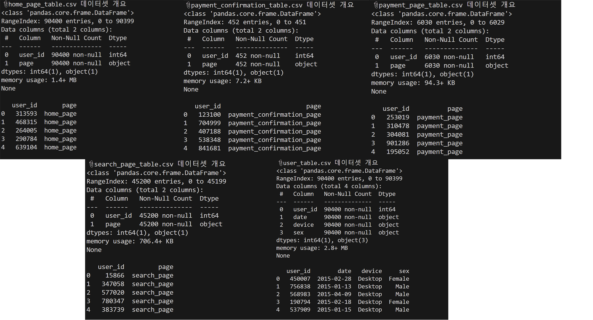
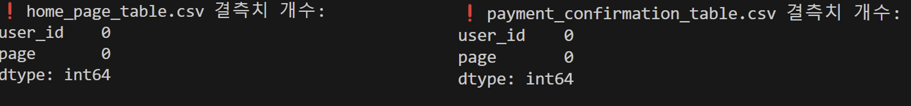
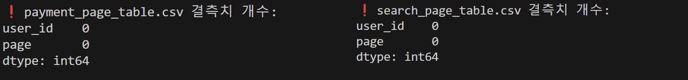
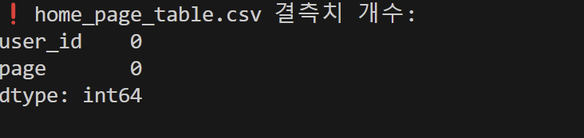
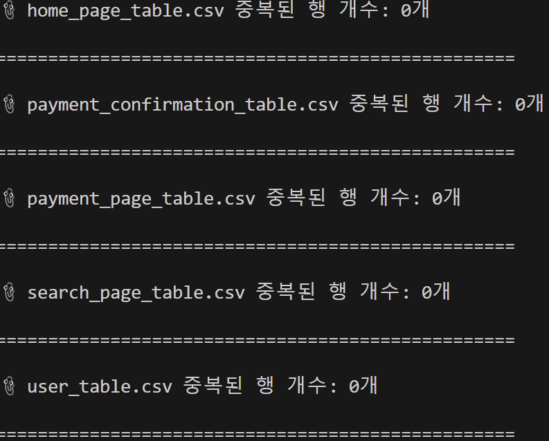
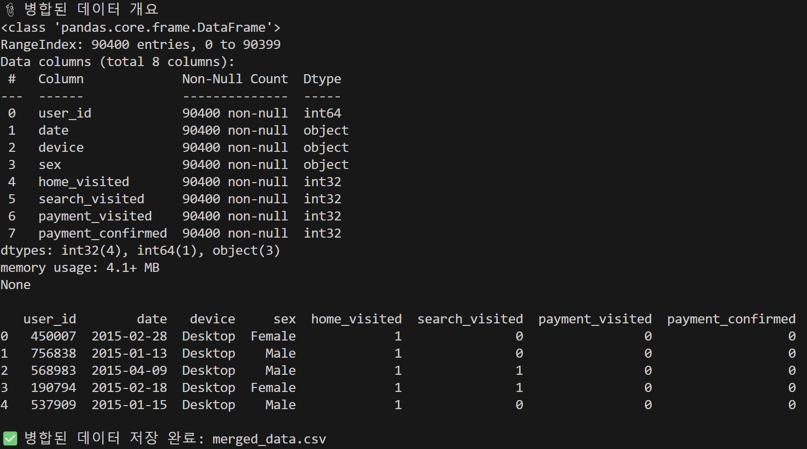

# E-commerce-Website_Funnel-Analysis
This is a project about Funnel Analysis using E-commerce Website dataset.

## About Dataset
- Dataset: E-commerce website
- Source: [Kaggle](https://www.kaggle.com/datasets/aerodinamicc/ecommerce-website-funnel-analysis)
- Description: Provides information on how users navigate through various pages of the website.

 

## Project Objectives
- Perform **Funnel Analysis** based on user behavior data within the website.
- Analyze **drop-off rates** and **conversion rates** at each stage.
- Derive insights to improve **user experience**.

 

## Project Process
1. Understanding the Data – Analyze dataset structure and variables.
2. Data Preprocessing – Handle missing values and clean data using **Python**.
3. **Funnel Analysis** – Calculate stage-wise conversion rates and drop-off rates.
4. Visualization Dashboard – Build an analytical dashboard using **Tableau**.
5. Identify Issues & Suggest Improvements – Derive insights and propose optimizations.

 

## Understanding the Data

### 📌 Dataset Overview and Relationships
| **File Name**                   | **Description**                               | **Details**                          |
|---------------------------------|------------------------------------------------|---------------------------------------|
| `home_page_table.csv` (📄)       | Homepage visit records                         | - `user_id` (User ID)   - `page` ("home_page")   - Records from **90,400** users |
| `search_page_table.csv` (🔍)     | Search page visit records                      | - `user_id`   - `page` ("search_page")   - Records from **45,200** users |
| `payment_page_table.csv` (💳)    | Payment page visit records                     | - `user_id`   - `page` ("payment_page")   - Records from **6,030** users |
| `payment_confirmation_table.csv` (✅) | Payment confirmation page visit records  | - `user_id`   - `page` ("payment_confirmation_page")   - Only **452** users completed the payment |
| `user_table.csv` (👤)            | User information                              | - `user_id` (User ID)   - `date` (Sign-up date)   - `device` (Device used: Desktop, etc.)   - `sex` (Gender: Male/Female)   - Contains information of all **90,400** users |

  

### 📌 Key Funnel Flow for Analysis
This dataset allows the analysis of the **drop-off rate** and **conversion rate** at each step as users navigate through the website. The funnel steps are as follows:

1. Homepage Visit (`home_page_table`)
2. Search Page Visit (`search_page_table`)
3. Payment Page Visit (`payment_page_table`)
4. Payment Confirmation (`payment_confirmation_table`)

This flow shows how users move from the homepage to the search page, proceed to the payment page, and finally reach the payment confirmation step. The funnel analysis will help identify the drop-off rates at each stage, providing insights into where users are leaving the site.

## Data Preprocessing

### 📌 Data Preprocessing Steps
1. Handling Missing Values (NaN Values)
   - Check for missing values in `user_table.csv` → Skip if none are found.
   - If missing values are present, either remove them or fill them with appropriate values.

2. Removing Duplicates
   - Check for duplicate rows based on `user_id`.
   - If duplicates are found, remove them.

3. Data Merging (Preparation for Funnel Analysis)
   - Merge each table based on `user_id`.
   - After merging, check for any NaN values again.

4. Additional Checks
   - Verify data with abnormal Funnel flow (e.g., Homepage → Search → Payment → Payment Confirmation).
   - Remove data that does not follow the expected Funnel flow.

### 📌 Handling Missing Values
- No missing values were found in any of the files.

&nbsp;&nbsp;&nbsp;&nbsp;&nbsp;&nbsp;&nbsp;&nbsp;&nbsp;&nbsp;

&nbsp;&nbsp;&nbsp;&nbsp;&nbsp;&nbsp;&nbsp;&nbsp;&nbsp;&nbsp;

&nbsp;&nbsp;&nbsp;&nbsp;&nbsp;&nbsp;&nbsp;&nbsp;&nbsp;&nbsp;

### 📌 Removing Duplicates
- No duplicate rows were found in any of the files.

&nbsp;&nbsp;&nbsp;&nbsp;&nbsp;&nbsp;&nbsp;&nbsp;&nbsp;&nbsp;

### 📌 Data Merging

#### Merging Method 
- The merging process is conducted using **LEFT JOIN** on `user_id` for each page visit data.
- The base table is `user_table.csv` (all users).
- Page visit data (`home_page`, `search_page`, `payment_page`, `payment_confirmation_page`) are sequentially merged.

#### 1️⃣ First Merge - `home_page_table.csv` (Homepage Visit Data)
- Only users who visited the homepage are included (using LEFT JOIN).
- If visited, `home_visited = 1`; if not visited, `NaN` → Later converted to `0`.

#### 2️⃣ Second Merge - `search_page_table.csv` (Search Page Visit Data)
- Adds search page visit status (`search_visited`)
- If not visited, `NaN` → Later converted to `0`

#### 3️⃣ Third Merge - `payment_page_table.csv` (Payment Page Visit Data)
- Adds payment page visit status (`payment_visited`)
- If not visited, `NaN` → Later converted to `0`

#### 4️⃣ Fourth Merge - `payment_confirmation_table.csv` (Payment Confirmation Data)
- Adds payment confirmation status (`payment_confirmed`)
- If payment was not completed, `NaN` → Later converted to `0`

#### ▶️  Final Data Description

| **Column Name**       | **Description**                                      |
|----------------------|--------------------------------------------------|
| `user_id`           | User ID                                          |
| `date`              | Sign-up date                                     |
| `device`            | Access device (Desktop, Mobile)                 |
| `sex`               | Gender (Male, Female)                           |
| `home_visited`      | Homepage visit status (1 = Visited, 0 = Not visited) |
| `search_visited`    | Search page visit status (1 = Visited, 0 = Not visited) |
| `payment_visited`   | Payment page visit status (1 = Visited, 0 = Not visited) |
| `payment_confirmed` | Payment completion status (1 = Completed, 0 = Not completed) |

  

### 🖍️ Additional Checks
Check for anomalies in the data, such as:  
1. Users visiting the **search page** without visiting the **homepage**  
2. Users visiting the **payment page** without visiting the **search page**  
3. Users completing the **payment** without visiting the **payment page** 

 

- No anomalies were found.

&nbsp;&nbsp;&nbsp;&nbsp;&nbsp;&nbsp;&nbsp;&nbsp;&nbsp;&nbsp;