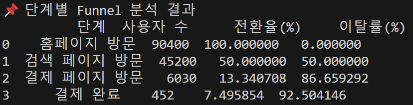

# E-commerce-Website_Funnel-Analysis
This is a project about Funnel Analysis using E-commerce Website dataset.

## About Dataset
- Dataset: E-commerce website
- Source: [Kaggle](https://www.kaggle.com/datasets/aerodinamicc/ecommerce-website-funnel-analysis)
- Description: Provides information on how users navigate through various pages of the website.

<br>

## Project Objectives
- Perform **Funnel Analysis** based on user behavior data within the website.
- Analyze **drop-off rates** and **conversion rates** at each stage.
- Derive insights to improve **user experience**.

<br>

## Project Process
1. Understanding the Data – Analyze dataset structure and variables.
2. Data Preprocessing – Handle missing values and clean data using **Python**.
3. **Funnel Analysis** – Calculate stage-wise conversion rates and drop-off rates.
4. Visualization Dashboard – Build an analytical dashboard using **Tableau**.
5. Identify Issues & Suggest Improvements – Derive insights and propose optimizations.

<br>

## Understanding the Data

### 📌 Dataset Overview and Relationships
| **File Name**                   | **Description**                               | **Details**                          |
|---------------------------------|------------------------------------------------|---------------------------------------|
| `home_page_table.csv` (📄)       | Homepage visit records                         | - `user_id` (User ID) <br> - `page` ("home_page") <br> - Records from **90,400** users |
| `search_page_table.csv` (🔍)     | Search page visit records                      | - `user_id` <br> - `page` ("search_page") <br> - Records from **45,200** users |
| `payment_page_table.csv` (💳)    | Payment page visit records                     | - `user_id` <br> - `page` ("payment_page") <br> - Records from **6,030** users |
| `payment_confirmation_table.csv` (✅) | Payment confirmation page visit records  | - `user_id` <br> - `page` ("payment_confirmation_page") <br> - Only **452** users completed the payment |
| `user_table.csv` (👤)            | User information                              | - `user_id` (User ID) <br> - `date` (Sign-up date) <br> - `device` (Device used: Desktop, etc.) <br> - `sex` (Gender: Male/Female) <br> - Contains information of all **90,400** users |

<p align="center">
  
</p>

### 📌 Key Funnel Flow for Analysis
This dataset allows the analysis of the **drop-off rate** and **conversion rate** at each step as users navigate through the website. The funnel steps are as follows:

1. Homepage Visit (`home_page_table`)
2. Search Page Visit (`search_page_table`)
3. Payment Page Visit (`payment_page_table`)
4. Payment Confirmation (`payment_confirmation_table`)

This flow shows how users move from the homepage to the search page, proceed to the payment page, and finally reach the payment confirmation step. The funnel analysis will help identify the drop-off rates at each stage, providing insights into where users are leaving the site.

### 📌 Python Code
```python
# 데이터 불러오기
for file in file_names:
    file_path = os.path.join(data_path, file)
    df = pd.read_csv(file_path)
    
    # 데이터 저장 (딕셔너리 형태로 저장)
    dataframes[file] = df
    
    # 기본 정보 출력
    print(f"📎{file} 데이터셋 개요")
    print(df.info(), "\n")  # 데이터 타입 및 결측치 확인
    print(df.head(), "\n")  # 상위 5개 행 출력
    print("="*50, "\n")  # 가독성을 위해...
    
    # 결측치 개수 출력
    missing_values = df.isnull().sum()  # 각 컬럼별 결측치 개수
    print(f"❗ {file} 결측치 개수:\n{missing_values}\n")
    print("="*50, "\n")
    
    # 중복 행 개수 출력력
    duplicate_count = df.duplicated().sum()  # 각 컬럼별 중복 개수수
    print(f"📎 {file} 중복된 행 개수: {duplicate_count}개\n")
    print("="*50, "\n")
```

<br>

## Data Preprocessing

### 📌 Data Preprocessing Steps
1. Handling Missing Values (NaN Values)
   - Check for missing values in `user_table.csv` → Skip if none are found.
   - If missing values are present, either remove them or fill them with appropriate values.

2. Removing Duplicates
   - Check for duplicate rows based on `user_id`.
   - If duplicates are found, remove them.

3. Data Merging (Preparation for Funnel Analysis)
   - Merge each table based on `user_id`.
   - After merging, check for any NaN values again.

4. Additional Checks
   - Verify data with abnormal Funnel flow (e.g., Homepage → Search → Payment → Payment Confirmation).
   - Remove data that does not follow the expected Funnel flow.

### 📌 Handling Missing Values
- No missing values were found in any of the files.

<p align="center">
   
</p>
<p align="center">
   
</p>
<p align="center">
   
</p>


### 📌 Removing Duplicates
- No duplicate rows were found in any of the files.
<p align="center">
   
</p>

### 📌 Data Merging

#### Merging Method 
- The merging process is conducted using **LEFT JOIN** on `user_id` for each page visit data.
- The base table is `user_table.csv` (all users).
- Page visit data (`home_page`, `search_page`, `payment_page`, `payment_confirmation_page`) are sequentially merged.

#### 1️⃣ First Merge - `home_page_table.csv` (Homepage Visit Data)
- Only users who visited the homepage are included (using LEFT JOIN).
- If visited, `home_visited = 1`; if not visited, `NaN` → Later converted to `0`.

#### 2️⃣ Second Merge - `search_page_table.csv` (Search Page Visit Data)
- Adds search page visit status (`search_visited`)
- If not visited, `NaN` → Later converted to `0`

#### 3️⃣ Third Merge - `payment_page_table.csv` (Payment Page Visit Data)
- Adds payment page visit status (`payment_visited`)
- If not visited, `NaN` → Later converted to `0`

#### 4️⃣ Fourth Merge - `payment_confirmation_table.csv` (Payment Confirmation Data)
- Adds payment confirmation status (`payment_confirmed`)
- If payment was not completed, `NaN` → Later converted to `0`

#### ▶️  Final Data Description

| **Column Name**       | **Description**                                      |
|----------------------|--------------------------------------------------|
| `user_id`           | User ID                                          |
| `date`              | Sign-up date                                     |
| `device`            | Access device (Desktop, Mobile)                 |
| `sex`               | Gender (Male, Female)                           |
| `home_visited`      | Homepage visit status (1 = Visited, 0 = Not visited) |
| `search_visited`    | Search page visit status (1 = Visited, 0 = Not visited) |
| `payment_visited`   | Payment page visit status (1 = Visited, 0 = Not visited) |
| `payment_confirmed` | Payment completion status (1 = Completed, 0 = Not completed) |

<p align="center">
  
</p>

### 🖍️ Additional Checks
Check for anomalies in the data, such as:  
1. Users visiting the **search page** without visiting the **homepage**  
2. Users visiting the **payment page** without visiting the **search page**  
3. Users completing the **payment** without visiting the **payment page** 

<br>

- No anomalies were found.
<p align="center">
   
</p>

### 📌 Python Code
```python
# CSV 파일 불러오기
home = pd.read_csv(os.path.join(data_path, "home_page_table.csv"))
search = pd.read_csv(os.path.join(data_path, "search_page_table.csv"))
payment = pd.read_csv(os.path.join(data_path, "payment_page_table.csv"))
confirmation = pd.read_csv(os.path.join(data_path, "payment_confirmation_table.csv"))
users = pd.read_csv(os.path.join(data_path, "user_table.csv"))

# 단계별 방문 여부 컬럼 추가
home["home_visited"] = 1
search["search_visited"] = 1
payment["payment_visited"] = 1
confirmation["payment_confirmed"] = 1

# 병합 (user_id 기준으로 LEFT 조인)
merged_df = users.merge(home[["user_id", "home_visited"]], on="user_id", how="left")
merged_df = merged_df.merge(search[["user_id", "search_visited"]], on="user_id", how="left")
merged_df = merged_df.merge(payment[["user_id", "payment_visited"]], on="user_id", how="left")
merged_df = merged_df.merge(confirmation[["user_id", "payment_confirmed"]], on="user_id", how="left")

# 결측치(방문하지 않은 경우 NaN으로 입력됨) 
# → 0으로 채우기
merged_df.fillna(0, inplace=True)

# 데이터 타입 정리 (int 변환) 
# → 병합 과정에서 생긴 NaN 값이 0으로 변환되었지만 기본적으로 float 타입임
merged_df[["home_visited", "search_visited", "payment_visited", "payment_confirmed"]] = merged_df[["home_visited", "search_visited", "payment_visited", "payment_confirmed"]].astype(int)

# 결과 확인
print("📎 병합된 데이터 개요")
print(merged_df.info(), "\n")
print(merged_df.head(), "\n")

# 병합된 데이터 저장
merged_df.to_csv("merged_data.csv", index=False)
print("✅ 병합된 데이터 저장 완료: merged_data.csv")

# 병합된 데이터 define
merged_df = pd.read_csv("merged_data.csv")

# 비정상적인 funnel 흐름 데이터 확인
invalid_cases = {
    "검색 페이지 방문 but 홈페이지 미방문": merged_df[(merged_df["search_visited"] == 1) & (merged_df["home_visited"] == 0)],
    "결제 페이지 방문 but 검색 페이지 미방문": merged_df[(merged_df["payment_visited"] == 1) & (merged_df["search_visited"] == 0)],
    "결제 완료 but 결제 페이지 미방문": merged_df[(merged_df["payment_confirmed"] == 1) & (merged_df["payment_visited"] == 0)]
}

# 결과 출력
for case, df in invalid_cases.items():
    print(f"\n❗ {case}: {len(df)}건 발견")
    if not df.empty:
        print(df[["user_id", "home_visited", "search_visited", "payment_visited", "payment_confirmed"]].head())
```

<br>

## Funnel Analysis

### 📌 Funnel Analysis Process
#### 1️⃣ Calculate the number of users at each stage
- Number of users with `home_visited = 1`
- Number of users with `search_visited = 1`
- Number of users with `payment_visited = 1`
- Number of users with `payment_confirmed = 1`

#### 2️⃣ Calculate Conversion Rate (%)
- Formula: `(Number of users at the current stage) ÷ (Number of users at the previous stage) × 100`
- Determine how many users proceed to the next stage.

#### 3️⃣ Calculate Drop-off Rate (%)
- Formula: `100 - Conversion Rate`
- Identify at which stage users drop off the most.

<p align="center">
   
</p>

### 📌 Funnel Analysis

In this Funnel analysis, we tracked the user journey from visiting the homepage to progressing through the **search → payment → payment confirmation** stages.

#### 1️⃣ Key Conversion Rate Analysis
- Homepage Visit → Payment Page Visit: **13.34%** (Drop-off: **86.66%**)  
   - Since search page data is missing, the intermediate steps are not visible.  
   - However, it appears that most users drop off before reaching the payment stage.  

- Payment Page Visit → Payment Completion: **7.50%** (Drop-off: **92.50%**)  
  - Most users who reached the payment page did **not** complete the payment.  
  - There might be obstacles in the payment process affecting conversions.  

#### 2️⃣ Key Drop-off Points
- The highest drop-off occurs between: **Homepage → Payment Page** (**86.66%**)  
- Final purchase completion rate: **7.50%** among users who reached the payment page.  
  - Further analysis is needed to identify reasons for user drop-off at the payment stage.  

### 📌 Python Code
```python
# 각 단계별 사용자 수 계산
home_users = merged_df["home_visited"].sum()
search_users = merged_df["search_visited"].sum()
payment_users = merged_df["payment_visited"].sum()
confirmed_users = merged_df["payment_confirmed"].sum()

# 전환율(Conversion Rate) 계산 
# → 분모가 0명이면 연산할 때 0으로 나누는 오류 즉, ZeroDivisionError이 발생할 수 있으므로 if절 추가
search_conversion = (search_users / home_users) * 100 if home_users > 0 else 0
payment_conversion = (payment_users / search_users) * 100 if search_users > 0 else 0
confirmed_conversion = (confirmed_users / payment_users) * 100 if payment_users > 0 else 0

# 이탈률(Drop-off Rate) 계산
search_dropoff = 100 - search_conversion
payment_dropoff = 100 - payment_conversion
confirmed_dropoff = 100 - confirmed_conversion

# 데이터프레임 생성
funnel_data = pd.DataFrame({
    "단계": ["홈페이지 방문", "검색 페이지 방문", "결제 페이지 방문", "결제 완료"],
    "사용자 수": [home_users, search_users, payment_users, confirmed_users],
    "전환율(%)": [100, search_conversion, payment_conversion, confirmed_conversion],  # 첫 단계는 100%
    "이탈률(%)": [0, search_dropoff, payment_dropoff, confirmed_dropoff]  # 첫 단계는 0%
})

# 결과 출력
print("\n📌 단계별 Funnel 분석 결과")
print(funnel_data)


# CSV 저장 (Excel 한글 깨짐 방지)
funnel_data.to_csv("funnel_analysis.csv", index=False, encoding="utf-8-sig")
print("\n✅ Funnel 분석 데이터 저장 완료: funnel_analysis.csv")
```